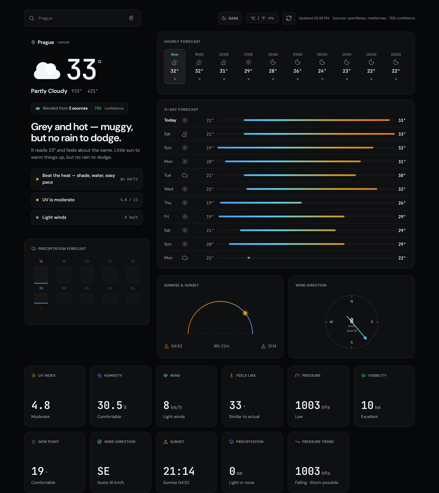
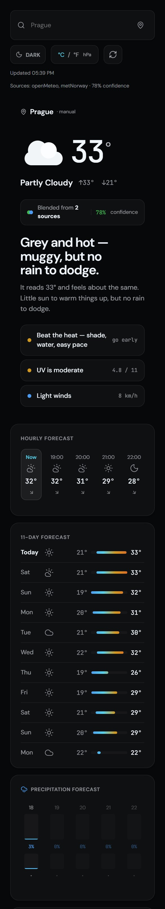

# Weather App

A weather app focused on source aggregation and confidence scoring. It combines forecasts from multiple providers into one result and shows how trustworthy that result is with a confidence score.

## Features

- 🔀 Multi-source weather aggregation
- 🎯 Confidence score based on cross-source agreement
- 📍 Automatic geolocation with fallback to default location
- 🌡️ Toggle between Celsius and Fahrenheit
- 🌓 Theme switcher with `System`, `Dark`, and `Light` modes
- 📲 Installable as a mobile/desktop web app (PWA)
- 📱 Responsive design (mobile, tablet, desktop)
- ♿ Accessible (ARIA labels, keyboard navigation)
- 🎨 Aurora-inspired UI across dark and light themes
- 🐳 Docker-ready with runtime configuration

## Screenshots

### Desktop



### Mobile



## Quick Start

### Local Development

```bash
# Install dependencies
npm install

# Start development server
npm run dev
```

Open http://localhost:5173

### Docker

```bash
# Build and run with default settings
docker build -t weather-app .
docker run -p 8080:80 weather-app

# Or use docker compose
docker compose up --build
```

Open http://localhost:8080

## Install as App (PWA)

When deployed over HTTPS, modern browsers can install this app to the home screen/app launcher.

- **Android/Chrome/Edge**: use browser menu -> `Install app` / `Add to Home screen`
- **iOS/Safari**: use Share -> `Add to Home Screen`

PWA support in this repo includes:

- Web app manifest
- Service worker registration (auto-updating)
- App icons for install surfaces

## Configuration

The app supports multiple weather API sources. Configure them via environment variables:

### Environment Variables

| Variable | Default | Description |
|----------|---------|-------------|
| `OPENMETEO_ENABLED` | `true` | Enable Open-Meteo (free, no key required) |
| `OPENWEATHER_ENABLED` | `false` | Enable OpenWeatherMap |
| `OPENWEATHER_API_KEY` | - | OpenWeatherMap API key |
| `WEATHERAPI_ENABLED` | `false` | Enable WeatherAPI |
| `WEATHERAPI_KEY` | - | WeatherAPI key |
| `NWS_ENABLED` | `true` | Enable National Weather Service (free, no key, US only) |
| `METNORWAY_ENABLED` | `true` | Enable MET Norway (free, no key, global, CC BY 4.0) |
| `PIRATEWEATHER_ENABLED` | `false` | Enable Pirate Weather (Dark Sky-compatible) |
| `PIRATEWEATHER_API_KEY` | - | Pirate Weather API key |
| `SHOW_SOURCES` | `false` | Show debug badge with contributing weather sources |
| `DEFAULT_LAT` | `40.7128` | Default latitude |
| `DEFAULT_LON` | `-74.0060` | Default longitude |
| `DEFAULT_LOCATION_NAME` | `New York` | Default location name |

### Docker with Custom Configuration

```bash
# Using docker run
docker run -p 8080:80 \
  -e OPENWEATHER_ENABLED=true \
  -e OPENWEATHER_API_KEY=your_api_key \
  -e DEFAULT_LOCATION_NAME="London" \
  -e DEFAULT_LAT=51.5074 \
  -e DEFAULT_LON=-0.1278 \
  weather-app

# Using docker compose with .env file
# Create a .env file with your variables, then:
docker compose up
```

### Security Note: API Keys

This is a fully client-side app — any API keys you configure are delivered to the
browser (via `config.js` or the build) and are visible to anyone who can load the
page. Only use keys from free tiers you are comfortable exposing, restrict them by
referrer/domain where the provider supports it, and never reuse keys that grant
access to paid quotas or other services. For untrusted audiences, proxy API calls
through your own backend instead.

### Local Development with Environment Variables

Create a `.env` file in the project root:

```env
OPENMETEO_ENABLED=true
OPENWEATHER_ENABLED=true
OPENWEATHER_API_KEY=your_api_key_here
NWS_ENABLED=true
SHOW_SOURCES=true
DEFAULT_LOCATION_NAME=London
```

Then run `npm run dev`.

## Unraid Template

This repo includes a Community Applications template: `unraid-template.xml`.

### Install via Community Applications

1. In Unraid, open **Apps**.
2. Add your template repository URL:
   - `https://raw.githubusercontent.com/aleksgain/weather-project/master/unraid-template.xml`
3. Search for **Weather App** and install.
4. Set API keys and fallback location values in the container template (optional).

## Weather API Sources

The app's primary value is blending these providers into a single forecast and surfacing a confidence score so users can judge forecast reliability at a glance.

### Open-Meteo (Default)
- **Free**: No API key required
- **Data**: Temperature, humidity, wind, pressure, UV index, hourly/daily forecasts
- **Docs**: https://open-meteo.com/

### OpenWeatherMap
- **Free tier**: 1,000 calls/day
- **Sign up**: https://openweathermap.org/api
- **Features**: Current weather, forecasts, air quality

### WeatherAPI
- **Free tier**: 1,000,000 calls/month
- **Sign up**: https://www.weatherapi.com/
- **Features**: Current weather, forecasts, astronomy

### National Weather Service (NWS)
- **Free**: No API key required
- **Coverage**: US only (`api.weather.gov`)
- **Features**: Forecasts and active weather alerts

### MET Norway
- **Free**: No API key required (CC BY 4.0 — commercial use allowed)
- **Coverage**: Global (`api.met.no`)
- **Features**: Hourly forecasts up to 10 days, independent Nordic-tuned model
- **Notes**: Requires a descriptive User-Agent per their [terms of service](https://api.met.no/doc/TermsOfService)

### Pirate Weather
- **Free tier**: 20,000 calls/month
- **Sign up**: https://pirate-weather.apiable.io/
- **Coverage**: Global (powered by NOAA GFS/HRRR/NBM)
- **Features**: Dark Sky-compatible JSON schema, hourly + daily forecasts, alerts

## Tech Stack

- **React 19** - UI framework
- **Vite 7** - Build tool
- **Lucide React** - Icons
- **Nginx** - Production server (Docker)

## Project Structure

```
src/
├── components/      # React components
│   ├── AtmosphericHero.jsx   # "How you'll feel" current-conditions hero
│   ├── WeatherIcon.jsx       # Animated, theme-aware weather icon
│   ├── Forecast.jsx
│   └── DetailedMetrics.jsx
├── config/          # App configuration
│   └── weather-sources.js
├── services/        # API services & multi-source aggregation
│   ├── weather.js
│   └── aggregator.js
├── utils/           # Utility functions
│   ├── weatherAdvice.js      # Plain-language headline + advice generator
│   └── unitConversion.js
├── App.jsx
├── App.css
├── index.css
└── main.jsx
```

## Security

- **API keys**: When using OpenWeatherMap or WeatherAPI, keys are injected at build/runtime and exposed in the client bundle. For production, consider using a backend proxy to keep keys server-side.
- **Geolocation**: The app requests location only when loading; no coordinates are stored or transmitted except to weather APIs.
- **Environment files**: Never commit `.env` with secrets. Use `.env.example` as a template.

## License

MIT
